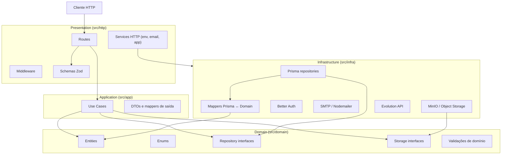
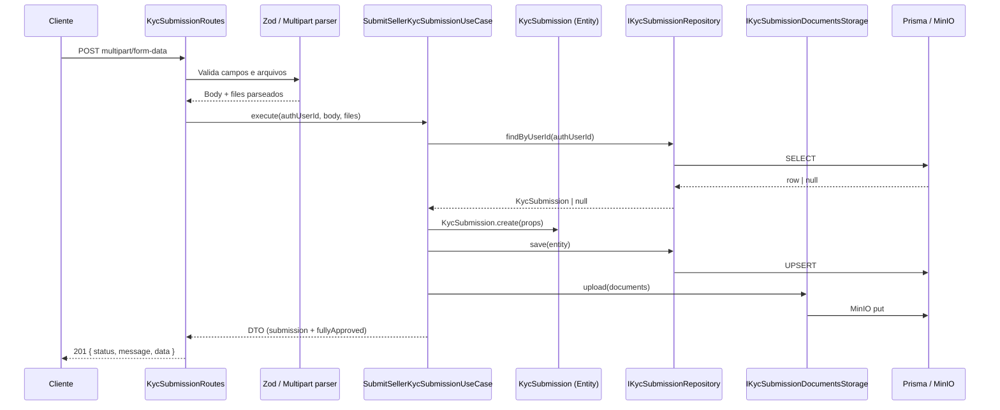
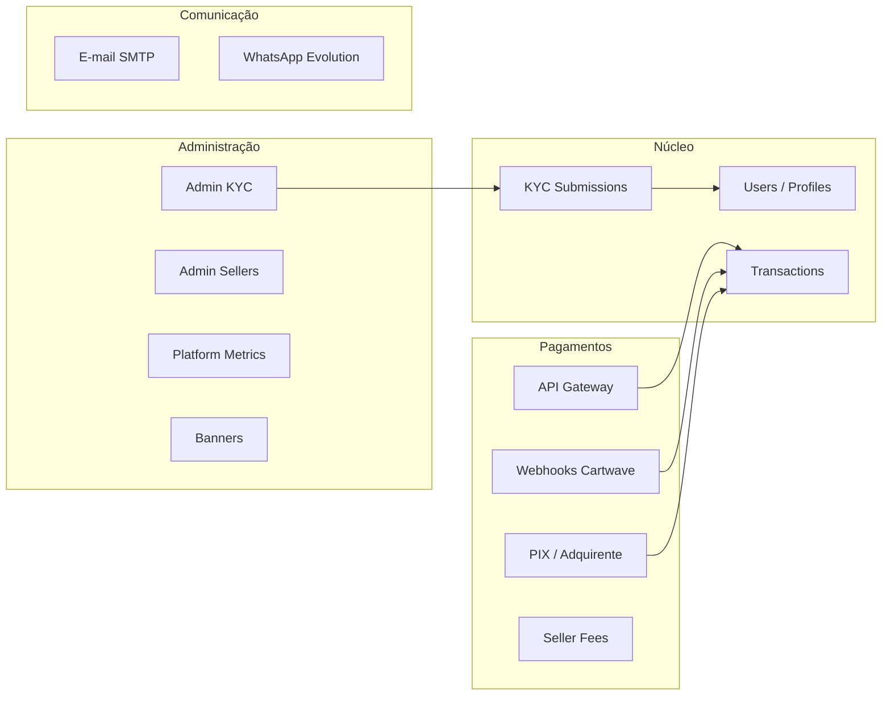

# Arquitetura do Backend

O backend utiliza o padrão **Clean Architecture** (Arquitetura Limpa). O objetivo é separar as responsabilidades do sistema em camadas independentes, cada uma com um papel bem definido, facilitando testes, manutenção e evolução do código.

---

## Visão geral



### Regra de dependência

As dependências **sempre apontam para dentro**:

| Camada                       | Pode depender de                                              |
| ---------------------------- | ------------------------------------------------------------- |
| **Presentation** (`http`)    | Application, Domain, Infrastructure (apenas na composição/DI) |
| **Application** (`app`)      | Domain                                                        |
| **Domain** (`domain`)        | Nada externo ao domínio                                       |
| **Infrastructure** (`infra`) | Domain                                                        |

Na prática, a camada de **Presentation** concentra a **composição de dependências** (injeção manual) em `AppService`, instanciando implementações concretas de `infra` e repassando interfaces de `domain` para rotas e casos de uso.

---

## Stack tecnológica

| Tecnologia      | Uso                                      |
| --------------- | ---------------------------------------- |
| **Bun**         | Runtime e bundler                        |
| **Elysia**      | Framework HTTP                           |
| **Prisma**      | ORM e migrations (PostgreSQL)            |
| **Better Auth** | Autenticação (email/senha, sessões)      |
| **Zod**         | Validação de entrada HTTP                |
| **Nodemailer**  | Envio de e-mails (SMTP)                  |
| **MinIO**       | Object storage (documentos KYC, banners) |
| **Sharp**       | Processamento de imagens                 |

**Entry point:** `backend/main/src/main.ts` → `HttpServerBootstrap` → `AppService.start()`.

**Alias de import:** `@/*` mapeia para `src/*` (configurado em `tsconfig.json`).

---

## Estrutura de pastas

```
backend/main/
├── prisma/                    # Schema, migrations e seeds
├── generated/prisma/          # Client Prisma gerado
└── src/
    ├── main.ts                # Ponto de entrada
    ├── http/                  # Presentation
    ├── app/                   # Application
    ├── domain/                # Domain
    └── infra/                 # Infrastructure
```

### `src/http` — Presentation

Responsável por receber requisições HTTP e devolver respostas. **Não contém lógica de negócio.**

```
src/http/
├── bootstrap.ts               # Inicialização do servidor
├── client.ts                  # HttpServerClient (Elysia + Swagger + CORS)
├── middleware/                # Autenticação e autorização por sessão
├── routes/
│   ├── base-http-route.ts     # Classe base com helpers de resposta/erro
│   ├── api/
│   │   ├── auth.routes.ts
│   │   └── v1/                # Rotas versionadas (/api/v1/*)
├── services/
│   ├── app/                   # AppService — composition root (DI manual)
│   ├── email/                 # Envio de e-mails e templates
│   └── env/                   # Leitura de variáveis de ambiente
├── utils/                     # Utilitários HTTP (ex.: error handler global)
└── validation/
    ├── schemas/               # Schemas Zod por endpoint
    └── *.util.ts              # Helpers de parsing (JSON, multipart, etc.)
```

### `src/app` — Application

Contém a **lógica de negócio** orquestrada em casos de uso.

```
src/app/usecases/
├── account/
├── admin/
├── balance/
├── banner/
├── email/
├── gateway/
├── gateway-theme/
├── kyc/
│   ├── dto/                   # DTOs de saída da camada de aplicação
│   └── map-*.util.ts          # Mappers Entity → DTO
├── pix/
├── rate-limit/
├── seller/
├── seller-fee/
├── session/
├── transaction/
├── user/
├── webhooks/
└── whatsapp/
```

### `src/domain` — Domain

Núcleo do sistema: regras e modelos de negócio **independentes de framework e banco.**

```
src/domain/
├── entities/                  # Entidades ricas (create, restore, métodos)
├── enums/                     # Enums de domínio
├── repositories/              # Interfaces de repositórios (contratos)
├── storages/                  # Interfaces de armazenamento de arquivos
├── validation/                # Validações puras (CPF, CNPJ, etc.)
├── acquirer/                  # Tipos relacionados a adquirentes de pagamento
└── whatsapp/                  # Interface de envio de WhatsApp
```

### `src/infra` — Infrastructure

Implementações concretas de persistência e integrações externas.

```
src/infra/
├── auth/                      # Client Better Auth
├── crypto/
├── database/
│   ├── prisma/
│   │   ├── client.ts
│   │   ├── mappers/           # Conversão Prisma model ↔ Entity
│   │   └── repositories/      # Implementações Prisma dos repositórios
│   └── seeds/
├── image/
├── object-storage/            # MinIO (KYC docs, banners)
├── smtp/
└── whatsapp/                  # Evolution API
```

### `src/shared` (convenção)

Pasta reservada para recursos compartilhados entre camadas (helpers, utils genéricos). No estado atual do projeto, utilitários equivalentes estão distribuídos em `domain/validation`, `http/utils` e `app/usecases/*/utils`.

---

## Regras de cada camada

### Camada de Presentation (`src/http`)

- **Não** deve conter lógica de negócio.
- Recebe requisições e retorna respostas padronizadas.
- Valida dados de entrada com **Zod** (`src/http/validation/schemas/`).
- Instancia e chama o **caso de uso** apropriado.
- Aplica **middleware** de autenticação/autorização.
- Trata erros previsíveis (`AppError`, `ZodError`) e delega o restante ao handler global.

#### Rotas

Cada módulo expõe uma classe que estende `BaseHttpRoute` e implementa `build()`:

```ts
export class KycSubmissionRoutes extends BaseHttpRoute {
  build(): THttpRoute {
    const route = this.serverClient.createSellerOrAdminRoute();

    route.get("/seller/kyc-submission", async ({ authUserId }) => {
      const useCase = new GetSellerKycSubmissionUseCase(/* deps */);
      const result = await useCase.execute(authUserId);
      return this.successResponse("OK", result, 200);
    });

    return route;
  }
}
```

#### Tipos de rota (autenticação)

O `HttpServerClient` oferece factories de rota com middleware embutido:

| Factory                      | Middleware                        | Uso                                       |
| ---------------------------- | --------------------------------- | ----------------------------------------- |
| `createPublicRoute()`        | Nenhum                            | Healthcheck, webhooks, endpoints públicos |
| `createUserRoute()`          | Sessão autenticada                | Usuário logado                            |
| `createAdminRoute()`         | Sessão + role `admin`             | Operações administrativas                 |
| `createSellerOrAdminRoute()` | Sessão + role `seller` ou `admin` | Fluxos de vendedor                        |

#### Formato de resposta

Sucesso:

```json
{
  "status": 200,
  "message": "OK",
  "data": {}
}
```

Erro (via `BaseHttpRoute` ou handler global):

```json
{
  "status": 400,
  "message": "Dados inválidos",
  "error": {},
  "code": "validation"
}
```

#### Composition root

`AppService` (`src/http/services/app/app.service.ts`) é o **ponto central de composição**:

1. Instancia repositórios Prisma, storages, serviços de e-mail/WhatsApp.
2. Registra todas as rotas em `/api/v1` e `/api`.
3. Registra o handler global de erros.
4. Inicia o servidor na porta definida por `PORT`.

---

### Camada de Application (`src/app`)

- Contém a **lógica de negócio** da aplicação.
- Orquestra entidades, repositórios (via interface) e storages (via interface).
- **Não** conhece HTTP, Prisma ou Elysia diretamente (exceto exceções pragmáticas documentadas abaixo).
- Retorna **DTOs** para a camada de Presentation, nunca entidades expostas diretamente ao cliente.

#### Caso de uso

Um caso de uso representa **uma ação de negócio** com entrada e saída bem definidas:

```ts
export class ApproveKycSubmissionUseCase {
  constructor(
    private readonly kycSubmissionRepository: IKycSubmissionRepository,
    private readonly sendSellerAccountApprovalEmailUseCase: SendSellerAccountApprovalEmailUseCase,
  ) {}

  async execute(submissionId: number): Promise<{ emailSent: boolean }> {
    const submission =
      await this.kycSubmissionRepository.findById(submissionId);

    if (!submission) {
      throw new AppError("Submissão KYC não encontrada", 404);
    }

    submission.setStatus(KycStatusEnum.APPROVED);
    submission.setReviewedAt(new Date());

    await this.kycSubmissionRepository.save(submission);

    // ... side effects (e-mail, etc.)
    return { emailSent: true };
  }
}
```

#### DTOs e mappers

DTOs ficam em `src/app/usecases/<modulo>/dto/` e descrevem o formato de saída da API. Funções `map-*-to-dto.util.ts` convertem entidades de domínio em DTOs:

```ts
export function mapKycSubmissionToDto(
  submission: KycSubmission,
  documentUrls: IGetKycSubmissionDocumentsUrlsResultDto | null,
): IKycSubmissionDto {
  const {
    kycSubmissionDocumentsId: _documentsId,
    bankData,
    ...submissionData
  } = submission.toObject();

  return {
    ...submissionData,
    bankData: mapKycSubmissionBankDataToDto(bankData),
    documents: mapDocumentsUrls(documentUrls),
  };
}
```

#### Organização por domínio funcional

| Pasta          | Responsabilidade                                   |
| -------------- | -------------------------------------------------- |
| `admin/`       | Operações administrativas (KYC, sellers, métricas) |
| `kyc/`         | Fluxo de KYC do vendedor                           |
| `gateway/`     | API Gateway de pagamentos                          |
| `transaction/` | Transações e ajustes                               |
| `balance/`     | Saldo do vendedor                                  |
| `pix/`         | Consultas PIX                                      |
| `email/`       | Casos de uso de envio de e-mail                    |
| `webhooks/`    | Processamento de webhooks de adquirente            |
| `session/`     | Contexto de sessão do usuário                      |

---

### Camada de Domain (`src/domain`)

- Contém o **modelo de negócio puro**.
- **Não** importa Prisma, Elysia, Zod ou qualquer detalhe de infraestrutura.
- Define **contratos** (interfaces) que a infraestrutura implementa.

#### Entidades

Entidades encapsulam estado e comportamento. Padrão adotado:

| Método                  | Propósito                                            |
| ----------------------- | ---------------------------------------------------- |
| `static create(props)`  | Cria entidade nova com defaults de negócio           |
| `static restore(props)` | Reconstrói entidade a partir de persistência         |
| `toObject()`            | Expõe props internas para mappers/DTOs               |
| Getters / setters       | Acesso controlado ao estado                          |
| Métodos de negócio      | Ex.: `isFullyApproved()`, `areAllSectionsApproved()` |

Exemplo (`KycSubmission`):

```ts
export class KycSubmission {
  private readonly props: IKycSubmissionProps;

  static create(props: IKycSubmissionCreateProps): KycSubmission {
    const now = new Date();
    return new KycSubmission({
      ...props,
      id: 0,
      status: KycStatusEnum.PENDING,
      documentsStatus: KycSubmissionSectionStatusEnum.PENDING,
      // ... demais defaults
      createdAt: now,
      updatedAt: now,
    });
  }

  static restore(props: IKycSubmissionProps): KycSubmission {
    return new KycSubmission(props);
  }

  isFullyApproved(): boolean {
    return (
      this.status === KycStatusEnum.APPROVED && this.areAllSectionsApproved()
    );
  }
}
```

#### Enums

Enums de domínio em `src/domain/enums/` espelham conceitos de negócio (ex.: `KycStatusEnum`, `TransactionStatusEnum`, `AppRoleEnum`). A infraestrutura converte entre enums Prisma e enums de domínio nos **mappers**.

#### Interfaces de repositório

Contratos em `src/domain/repositories/` definem o que a aplicação precisa persistir, sem expor detalhes de banco:

```ts
export interface IKycSubmissionRepository {
  findById(id: number): Promise<KycSubmission | null>;
  findByUserId(userId: number): Promise<KycSubmission | null>;
  save(submission: KycSubmission): Promise<KycSubmission>;
}
```

#### Interfaces de storage

Contratos em `src/domain/storages/` para operações de arquivo (upload, URLs assinadas, delete):

```ts
export interface IKycSubmissionDocumentsStorage {
  upload(props: IUploadKycSubmissionDocumentsProps): Promise<void>;
  getUrls(
    props: Omit<IGetKycSubmissionDocumentsUrlProps, "field">,
  ): Promise<IGetKycSubmissionDocumentsUrlsResultDto>;
  delete(props: IDeleteKycSubmissionDocumentsProps): Promise<void>;
}
```

#### Validações de domínio

Funções puras reutilizáveis, como `isValidCpf` e `isValidCnpj` em `src/domain/validation/`. Podem ser usadas tanto nos schemas Zod da Presentation quanto nos casos de uso.

---

### Camada de Infrastructure (`src/infra`)

- Implementa os contratos definidos no Domain.
- Conhece Prisma, MinIO, SMTP, Better Auth, APIs externas.
- **Nunca** é importada diretamente pelos casos de uso — apenas injetada via interface.

#### Repositórios Prisma

Implementações em `src/infra/database/prisma/repositories/` estendem `BasePrismaRepository` e implementam a interface de domínio:

```ts
export class PrismaKycSubmissionRepository
  extends BasePrismaRepository
  implements IKycSubmissionRepository
{
  async findByUserId(userId: number): Promise<KycSubmission | null> {
    const row = await this.getPrismaClient().kycSubmission.findUnique({
      where: { userId },
      include: { kycSubmissionBankData: true, kycSubmissionDocuments: true },
    });
    return row ? KycSubmissionMapper.toDomain(row) : null;
  }

  async save(submission: KycSubmission): Promise<KycSubmission> {
    const row = await this.getPrismaClient().kycSubmission.upsert({
      where: { id: submission.id },
      update: KycSubmissionMapper.toPrismaUpdate(submission),
      create: KycSubmissionMapper.toPrismaCreate(submission),
      include: { kycSubmissionBankData: true, kycSubmissionDocuments: true },
    });
    return KycSubmissionMapper.toDomain(row);
  }
}
```

#### Mappers

Classes em `src/infra/database/prisma/mappers/` fazem a ponte entre modelos Prisma e entidades de domínio:

| Direção                  | Método típico            |
| ------------------------ | ------------------------ |
| Banco → Domínio          | `toDomain(row)`          |
| Domínio → Banco (create) | `toPrismaCreate(entity)` |
| Domínio → Banco (update) | `toPrismaUpdate(entity)` |

Os mappers também convertem enums Prisma ↔ enums de domínio.

#### Integrações externas

| Módulo                 | Responsabilidade                      |
| ---------------------- | ------------------------------------- |
| `infra/auth`           | Better Auth + adapter Prisma          |
| `infra/smtp`           | Cliente SMTP (Nodemailer)             |
| `infra/object-storage` | MinIO — documentos KYC, banners       |
| `infra/whatsapp`       | Evolution API para envio de mensagens |
| `infra/crypto`         | Operações criptográficas              |
| `infra/image`          | Processamento de imagens (Sharp)      |

#### Banco de dados

- **Schema:** `backend/main/prisma/schema.prisma`
- **Client gerado:** `backend/main/generated/prisma/`
- **Migrations:** `backend/main/prisma/migrations/`
- **Seeds:** `backend/main/src/infra/database/seeds/`

Comandos úteis (`package.json`):

```bash
bun run prisma:generate    # Gera o client Prisma
bun run db:migrate:deploy  # Aplica migrations
bun run db:seed            # Executa seeds
```

---

## Fluxo de uma requisição

Exemplo: `POST /api/v1/seller/kyc-submission`



Passos resumidos:

1. **Middleware** valida sessão e extrai `authUserId`.
2. **Rota** faz parse e validação (Zod + utilitários de multipart).
3. **Caso de uso** aplica regras de negócio, cria/manipula entidades.
4. **Repositório/Storage** persistem via infraestrutura.
5. **Mapper de DTO** transforma entidade em formato de resposta.
6. **Rota** retorna `successResponse` ou trata `AppError`.

---

## Tratamento de erros

### `AppError`

Erro de negócio esperado, com código HTTP associado:

```ts
export class AppError extends Error {
  constructor(
    public readonly message: string,
    public readonly statusCode: number,
    public readonly data?: Record<string, unknown>,
  ) {
    super(message);
  }
}
```

Usado nos casos de uso para situações como recurso não encontrado, conflito, permissão negada, etc.

> **Nota:** `AppError` hoje reside em `src/http/services/app/errors/`. Idealmente, em uma evolução futura, poderia migrar para `src/domain/errors/` para que a camada Application não dependa de Presentation.

### Handler global

`registerGlobalApiErrorHandler` captura erros não tratados nas rotas, registra log estruturado (`API_ERROR_LOG`) e retorna resposta JSON padronizada. Erros 5xx expõem mensagem genérica ao cliente; detalhes ficam no log.

### Erros de validação

- **Zod:** tratados nas rotas via `handleError` ou blocos `catch` com `zodErrorToMessage`.
- **Elysia ValidationError:** convertidos pelo handler global em HTTP 422.

---

## Autenticação e autorização

Autenticação via **Better Auth** (`src/infra/auth/client.ts`), integrado ao Prisma.

Middlewares em `src/http/middleware/`:

1. `createAuthSessionUserMiddleware` — resolve sessão e `authUserId`.
2. Middlewares compostos (`admin`, `seller-or-admin`) — consultam `userRole` no banco e lançam `AppError` 401/403 quando aplicável.

Rotas de autenticação (`/api/auth/*`) ficam em `AuthRoutes`, separadas das rotas versionadas `/api/v1`.

---

## Convenções de nomenclatura

| Artefato                 | Padrão                        | Exemplo                                       |
| ------------------------ | ----------------------------- | --------------------------------------------- |
| Entidade                 | `<nome>.entity.ts`            | `kyc-submission.entity.ts`                    |
| Enum                     | `<nome>.enum.ts`              | `kyc-status.enum.ts`                          |
| Interface de repositório | `I<Nome>Repository`           | `IKycSubmissionRepository`                    |
| Implementação Prisma     | `Prisma<Nome>Repository`      | `PrismaKycSubmissionRepository`               |
| Caso de uso              | `<Verbo><Nome>UseCase`        | `SubmitSellerKycSubmissionUseCase`            |
| Rota                     | `<Nome>Routes`                | `KycSubmissionRoutes`                         |
| Schema Zod               | `<contexto>-<tipo>.schema.ts` | `submit-seller-kyc-submission-body.schema.ts` |
| Mapper Prisma            | `<Nome>Mapper`                | `KycSubmissionMapper`                         |
| DTO                      | `I<Nome>Dto`                  | `IKycSubmissionDto`                           |

---

## Como adicionar uma nova funcionalidade

Checklist recomendado, de dentro para fora:

1. **Domain**
   - [ ] Criar/alterar entidade em `src/domain/entities/`
   - [ ] Criar enums em `src/domain/enums/` (se necessário)
   - [ ] Definir interface de repositório em `src/domain/repositories/`
   - [ ] Definir interface de storage em `src/domain/storages/` (se houver arquivos)

2. **Infrastructure**
   - [ ] Atualizar `prisma/schema.prisma` e rodar migration
   - [ ] Criar mapper em `src/infra/database/prisma/mappers/`
   - [ ] Implementar repositório Prisma em `src/infra/database/prisma/repositories/`
   - [ ] Implementar storage ou integração externa (se aplicável)

3. **Application**
   - [ ] Criar caso(s) de uso em `src/app/usecases/<modulo>/`
   - [ ] Criar DTOs e mappers de saída em `dto/` e `map-*.util.ts`

4. **Presentation**
   - [ ] Criar schemas Zod em `src/http/validation/schemas/`
   - [ ] Criar rota em `src/http/routes/api/v1/`
   - [ ] Registrar dependências e rota em `AppService`
   - [ ] Escolher factory de rota correta (`public`, `user`, `admin`, `seller-or-admin`)

5. **Verificação**
   - [ ] `bun run type-check`
   - [ ] Testar endpoint via Swagger (`/swagger`)

---

## Desvios pragmáticos (estado atual)

Algumas decisões fogem levemente do Clean Architecture ideal, por simplicidade:

| Situação                       | Onde                            | Observação                                        |
| ------------------------------ | ------------------------------- | ------------------------------------------------- |
| `AppError` na camada HTTP      | `src/http/services/app/errors/` | Casos de uso importam erro de Presentation        |
| Tipos de body Zod em use cases | Alguns use cases de KYC         | Tipos de validação HTTP vazam para Application    |
| `EnvService` usado em infra    | `prisma/client.ts`              | Infra depende de serviço HTTP para `DATABASE_URL` |
| Composição manual              | `AppService`                    | Sem container DI; instanciação explícita          |

Esses pontos não impedem a separação de responsabilidades, mas são candidatos a refatoração futura se o projeto crescer.

---

## Diagrama de módulos de negócio



---

## Referências no repositório

| Arquivo                                               | Descrição                            |
| ----------------------------------------------------- | ------------------------------------ |
| `src/main.ts`                                         | Entry point                          |
| `src/http/bootstrap.ts`                               | Bootstrap do servidor                |
| `src/http/services/app/app.service.ts`                | Composition root e registro de rotas |
| `src/http/client.ts`                                  | Cliente Elysia e factories de rota   |
| `src/http/routes/base-http-route.ts`                  | Classe base de rotas                 |
| `src/http/utils/register-global-api-error-handler.ts` | Handler global de erros              |
| `prisma/schema.prisma`                                | Modelo de dados                      |
| `env.example`                                         | Variáveis de ambiente esperadas      |
