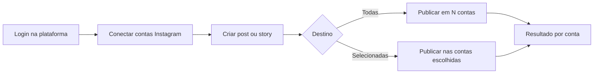

# Visão geral do projeto

Plataforma para **publicação centralizada no Instagram**. Um usuário da plataforma conecta **várias contas do Instagram** e publica **posts** e **stories** a partir de um único lugar, escolhendo se o conteúdo vai para **todas** as contas conectadas ou **apenas para algumas**.

---

## O que é este projeto

Este repositório contém o **backend** da plataforma. Ele expõe a API, persiste dados, gerencia autenticação dos usuários da plataforma, armazena o vínculo com contas do Instagram e orquestra a publicação de conteúdo via integrações com a API do Instagram.

O frontend (fora deste repositório) consome essa API para que o usuário:

1. Crie uma conta na plataforma e faça login.
2. Conecte uma ou mais contas do Instagram (OAuth / tokens autorizados).
3. Crie um post ou story e defina o **escopo de publicação** (todas as contas ou um subconjunto).
4. Dispare a publicação e acompanhe o resultado por conta.

A arquitetura técnica do backend (Clean Architecture, stack, camadas e convenções) está descrita em [`architeture.md`](./architeture.md).

---

## Objetivo

Reduzir o trabalho repetitivo de quem administra **múltiplos perfis no Instagram** — criadores, marcas, agências ou gestores de redes sociais — permitindo **uma única ação de publicação** replicada de forma controlada em várias contas.

Em vez de abrir cada perfil no app ou no Meta Business Suite e repetir o mesmo upload, legenda e configuração, o usuário faz isso **uma vez na plataforma** e escolhe onde o conteúdo deve aparecer.

---

## Escopo inicial (MVP)

Na primeira versão, o foco é exclusivamente em **publicação de conteúdo**, sem agendamento avançado, analytics ou automações extras (salvo o que for necessário para conectar contas e publicar com segurança).

### Funcionalidades principais

| Área | Descrição |
| ---- | --------- |
| **Contas na plataforma** | Cadastro, login e sessão do usuário que usa a plataforma (não confundir com contas do Instagram). |
| **Conexão com Instagram** | Cada usuário pode vincular **N contas** do Instagram; tokens e metadados mínimos ficam persistidos de forma segura. |
| **Publicação de posts** | Upload de mídia e metadados (legenda, etc.) com publicação na API do Instagram. |
| **Publicação de stories** | Envio de story (imagem/vídeo conforme suporte da API) para as contas selecionadas. |
| **Seleção de destino** | Em cada publicação, o usuário escolhe **todas as contas conectadas** ou **apenas as que quiser**. |

### Fora do escopo inicial (explícito)

- Agendamento de posts/stories para data/hora futura.
- Métricas, insights ou relatórios do Instagram.
- Respostas a comentários, DMs ou moderação.
- Edição ou exclusão em massa de publicações antigas.
- Outras redes sociais além do Instagram.

Esses itens podem entrar em fases posteriores; não fazem parte do MVP descrito acima.

---

## Conceitos de domínio

### Usuário da plataforma

Pessoa ou organização autenticada no sistema. É dona das conexões com Instagram e das ações de publicação.

### Conta do Instagram conectada

Perfil do Instagram autorizado pelo usuário da plataforma via fluxo OAuth (Meta). Cada vínculo é independente: um usuário pode ter várias contas conectadas ao mesmo tempo.

### Publicação

Ação de enviar **um conteúdo** (post ou story) para **um ou mais destinos** (contas conectadas). Uma publicação na plataforma pode gerar **várias execuções** — uma por conta selecionada — com status individual (sucesso, falha, pendente).

### Escopo de destino

Define **para quais contas** uma publicação será enviada:

- **Todas**: todas as contas conectadas e válidas no momento da publicação.
- **Selecionadas**: subconjunto explícito escolhido pelo usuário (por IDs das contas conectadas).

---

## Fluxo resumido do usuário

1. O usuário autentica-se na plataforma.
2. Conecta uma ou mais contas do Instagram (pode adicionar ou remover vínculos depois).
3. Monta um post ou story (mídia + dados necessários).
4. Define o escopo: todas as contas ou lista específica.
5. O backend valida permissões, tokens e regras de negócio, dispara a publicação por conta e registra o resultado.

---

## Princípios de produto

- **Simplicidade no MVP**: conectar contas, publicar post/story, escolher destino — nada além disso na v1.
- **Controle explícito**: o usuário sempre sabe **em quais contas** o conteúdo será publicado; não há publicação “silenciosa” em conta não selecionada.
- **Transparência por conta**: falha em uma conta não deve ocultar sucesso nas outras; o status deve ser reportado **por destino**.
- **Segurança**: tokens do Instagram e dados sensíveis tratados apenas no backend; o cliente não expõe credenciais de integração.

---

## Relação com o backend

Este backend é responsável por:

- Autenticação e autorização dos **usuários da plataforma**.
- CRUD de **contas Instagram conectadas** (vínculo, refresh de token, desconexão).
- Orquestração de **publicações** (post e story) com seleção de destino.
- Persistência de histórico mínimo necessário para idempotência, auditoria e feedback ao usuário.
- Integração com **APIs do Instagram / Meta** conforme limites e políticas oficiais.

A implementação deve seguir a Clean Architecture e as convenções documentadas em [`architeture.md`](./architeture.md), adaptando entidades, casos de uso e integrações ao domínio descrito neste documento — e não ao domínio de exemplos genéricos que possam aparecer na documentação de arquitetura herdada de outros projetos.

---

## Glossário rápido

| Termo | Significado |
| ----- | ----------- |
| **Plataforma** | Este produto (app + backend) usado pelo gestor de conteúdo. |
| **Conta conectada** | Perfil do Instagram vinculado a um usuário da plataforma. |
| **Post** | Publicação no feed (foto, vídeo ou carrossel, conforme API). |
| **Story** | Conteúdo efêmero no stories do Instagram. |
| **Destino** | Conta(s) do Instagram que receberão uma publicação. |
| **Publicação em lote** | Uma intenção de publicar o mesmo conteúdo em múltiplos destinos de uma vez. |
